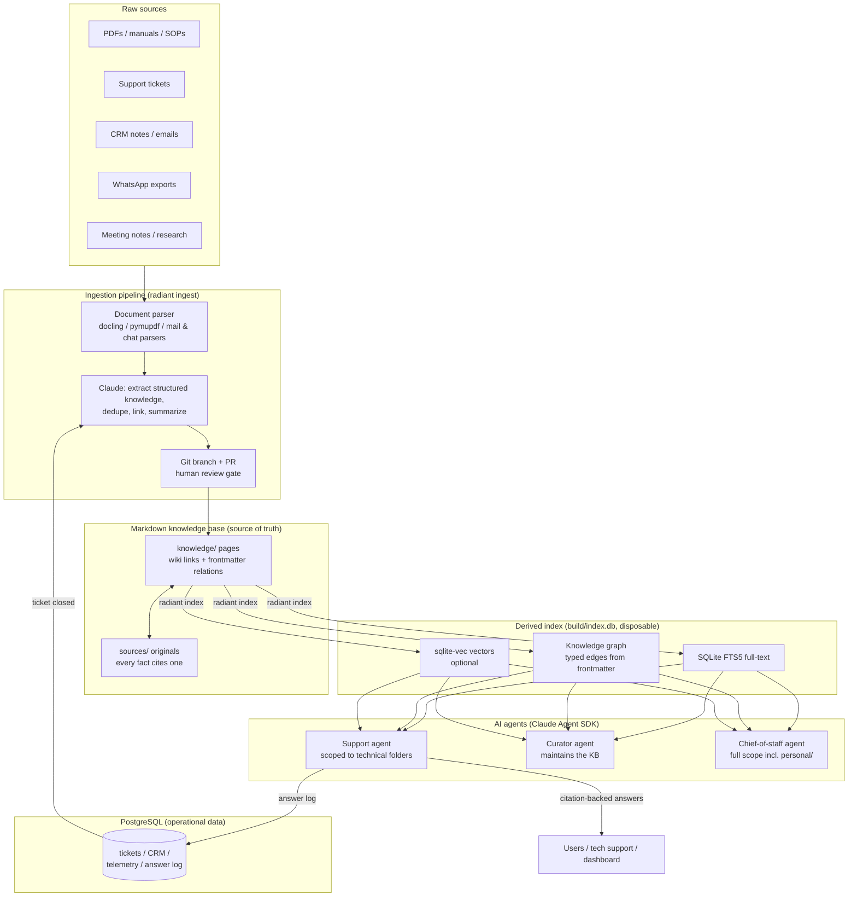

# 01 — Architecture

## System overview

RadiantBrain is one system with two faces: a personal second brain and the RadiantBots technical knowledge engine. Both share the same storage model (Markdown in Git), the same tooling (the `radiant` CLI), and the same retrieval stack — they differ only in which folders each agent is allowed to read.

## Components

### 1. Markdown knowledge base (`knowledge/`)
The single source of truth. Every piece of knowledge is a Markdown page with YAML frontmatter, wiki links, and citations back to original sources. Spec: [02-knowledge-spec.md](02-knowledge-spec.md).

### 2. Sources archive (`sources/`)
Original documents (PDFs, chat exports, email dumps) that pages cite. Stored with Git LFS initially; migrate to object storage (S3/R2) with a pointer manifest when the repo passes ~1–2 GB. A page is never allowed to state a technical fact without a source reference.

### 3. The `radiant` CLI
One Python CLI is the interface for everything — humans and agents both use it. This keeps the pipeline scriptable and testable.

| Command | What it does |
|---|---|
| `radiant new <type> <slug>` | Create a page from `templates/<type>.md` |
| `radiant ingest <path\|url>` | Parse a source, propose KB edits on a branch |
| `radiant index` | Rebuild `build/index.db` (FTS + graph + vectors) from Markdown |
| `radiant search <query>` | Tiered search: aliases → full-text → graph → vectors |
| `radiant ask <question>` | Retrieval + Claude answer with verified citations |
| `radiant learn --ticket <id>` | Fold a closed ticket back into the KB (PR) |
| `radiant lint` | Validate frontmatter schemas, wiki links, citation markers |

### 4. Derived index (`build/index.db`)
A single SQLite file, gitignored, rebuilt from Markdown at any time by `radiant index`. It holds three things:

- **FTS5 tables** — full-text search over page bodies, titles, aliases.
- **Graph tables** — nodes (pages) and typed edges parsed from frontmatter relations plus untyped `mentions` edges from body wiki links.
- **Vector table (optional, sqlite-vec)** — chunk embeddings for semantic fallback.

Because the index is derived, there is no synchronization problem: Git history is truth, the index is a cache. CI rebuilds it on every merge to main.

### 5. Agents
Built on the Claude Agent SDK. Each agent has a declared **scope** (folder allowlist) enforced by the retrieval layer, an **answer contract** (structured output with citations), and a **citation verifier** that rejects answers referencing nonexistent pages/sections. Spec: [05-agents.md](05-agents.md).

### 6. PostgreSQL operational store
Tickets, CRM records, robot fleet data, telemetry, and the agent answer log. Operational data never lives in Markdown; Markdown never stores per-unit operational records. The two layers link by **page slug** (e.g. a `tickets` row carries `error_slugs = ['error203']`). Spec: [06-operational-data.md](06-operational-data.md).

## The two loops

**Ingestion loop (batch):** a new manual, SOP, or export arrives → `radiant ingest` parses it → Claude extracts knowledge and proposes page creations/updates (updating existing pages rather than duplicating) → changes land as a PR → human reviews and merges → index rebuilds.

**Learning loop (continuous):** a support ticket closes in the ticketing system → webhook (or `radiant learn`) fires → Claude reads the ticket transcript, extracts the confirmed resolution → updates the relevant error-code/procedure/firmware pages and adds relationships → PR titled `learn: ticket #1234` → merge policy decides auto-merge vs. human review. Details: [03-pipelines.md](03-pipelines.md).

## Key decisions and rationale

| # | Decision | Rationale | Rejected alternative |
|---|---|---|---|
| D1 | Markdown in Git as source of truth | Inspectable, diffable, reviewable via PRs; AI edits become auditable changes; survives any tool churn | Vector DB as primary store (opaque, no review workflow, no history) |
| D2 | Derived single-file SQLite index (FTS5 + graph + sqlite-vec) | Zero-ops, rebuildable, one artifact serves all three retrieval tiers; no sync bugs by construction | Neo4j + Elasticsearch + Pinecone (three services to run and keep consistent with Git) |
| D3 | Typed relations in frontmatter, untyped links in body | Frontmatter gives a machine-parseable graph (`fixed_in: [v2.8]`); body wiki links stay frictionless for humans | Only free-form `[[links]]` (graph too weak for robot→error→firmware→procedure traversal) |
| D4 | All AI writes go through Git branches/PRs | Human review gate, easy rollback, provenance in commit history; merge policy can be loosened per-pipeline as trust grows | Agents writing directly to main (silent corruption risk) |
| D5 | Python for CLI + pipeline | Best PDF/document parsing ecosystem (docling, pymupdf), Claude Agent SDK support, fast to iterate | TypeScript (viable; switch only if the dashboard team wants one language) |
| D6 | Two-hop citations: answer → page section → source doc | Agents cite stable curated pages, pages cite raw docs; raw docs can be messy without polluting answers | Answers citing raw PDFs directly (fragile page offsets, unreviewed content) |
| D7 | One repo, folder-level agent scoping for `personal/` | Personal and technical knowledge cross-link (a customer meeting note links to a robot page); scoping keeps the support agent out of `personal/` | Two repos (loses cross-linking; revisit if the KB gets shared with a team — `personal/` can be split into a private submodule later without changing conventions) |
| D8 | Operational data in PostgreSQL, linked by slug | High-churn per-unit data (tickets, telemetry) would drown Git history and is naturally relational/aggregable | Everything in Markdown (unqueryable, noisy diffs) |
| D9 | Vectors optional and last in the search cascade | Pages + graph answer most queries explainably; embeddings only catch fuzzy wording; keeps day-1 build simple | Embeddings-first RAG (unexplainable retrieval, chunk-boundary artifacts, index drift) |

## Technology stack

| Layer | Choice | Notes |
|---|---|---|
| Storage | Git + Markdown; Git LFS → S3 for large sources | GitHub for PRs/CI |
| Structured/ops data | PostgreSQL 16 | Managed (Neon/RDS) or single Docker container |
| Parsing | docling (PDF→Markdown), pymupdf fallback, `mailbox`/custom parsers for email & WhatsApp | |
| Index | SQLite: FTS5 + graph tables + sqlite-vec | One file: `build/index.db` |
| Embeddings (optional) | voyage-3-large or any hosted embedding API | Only chunks, rebuildable |
| AI — bulk extraction | Claude Sonnet (latest) | Ingestion, summarization, dedup |
| AI — reasoning/answers | Claude Opus-class (latest) | Support answers, curation judgment |
| Orchestration | Claude Agent SDK (Python) | Agents defined as scoped tools + prompts |
| CLI | Python 3.12, `typer`, packaged with `uv` | |
| CI | GitHub Actions | lint, link-check, index rebuild, evals |
| Dashboard (later) | Read-only web app over PostgreSQL + rendered Markdown | Phase 5 |

## Non-goals (for now)

- Real-time collaborative editing (Git PRs are the collaboration model).
- Multi-tenant knowledge bases (single-org design; revisit if RadiantBots productizes this).
- Automatic writes to main without review (merge policy starts strict, loosens with measured trust).
